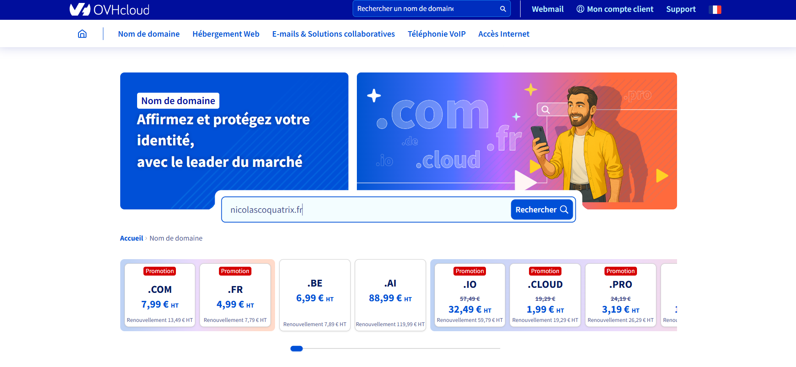
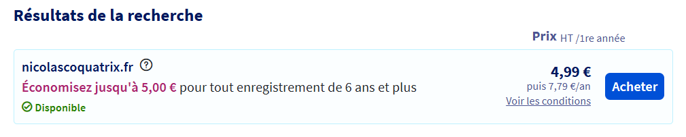
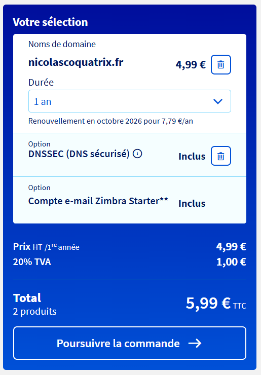
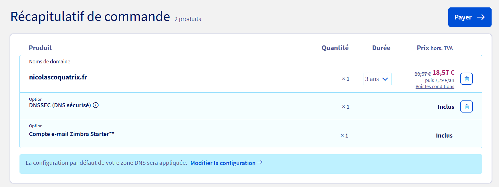

# Questions

Répondez ici aux questions théoriques en détaillant un maxium vos réponses :

## 1) Expliquer la procédure pour réserver un nom de domaine chez OVH avec des captures d'écran (arrêtez-vous au paiement) :

- Se rendre sur : https://www.ovhcloud.com/fr/domains/
 :
- Vérifier la disponibilité et cliquer sur "Acheter" :

- Renseigner la durée et les options et cliquer sur "Poursuivre la commande" :

- Se connecter ou créer un compte
- Renseigner les contacts
- Payer :

## 2) Comment faire pour qu'un nom de domaine pointe vers une adresse IP spécifique ?

Il faut ajouter un enregistrement dans la zone DNS qui va faire le lien entre le nom de domaine et l’IP (nom-domaine.fr -> DNS -> adresse ip).

## 3) Comment mettre en place un certificat SSL ?

Avec aaPanel : 
- Sélectionner le site en cliquant sur le nom de domaine
- Se rendre dans l’onglet "SSL"
- Sélectionner "Let’s Encrypt"
- Cocher le nom de domaine
- Cliquer sur le bouton "Apply"
